## Columns of the dataset:

    Pregnancies: Number of times pregnant
    Glucose: Plasma glucose concentration 2 hours in an oral glucose tolerance test
    Blood Pressure: Diastolic blood pressure (mm Hg)
    Skin Thickness: Triceps skin fold thickness (mm
    Insulin: 2-Hour serum insulin (mu U/ml)
    BMI: Body mass index (weight in kg/(height in m)^2) 
    Diabetes Pedigree Function: Diabetes pedigree function
    Age: Age (years)
    Outcome: Class variable (0 or 1) 0 mean non-diabetic and 1 means diabetic


```python
# Importing the required packages here

import numpy as np
import pandas as pd
import seaborn as sns

from datetime import datetime
import matplotlib.pyplot as plt

```


```python
import missingno as msno
%matplotlib inline
```


```python
df = pd.read_csv('diabetes.csv')
df.head()
```


<div>
<style scoped>
    .dataframe tbody tr th:only-of-type {
        vertical-align: middle;
    }

    .dataframe tbody tr th {
        vertical-align: top;
    }

    .dataframe thead th {
        text-align: right;
    }
</style>
<table border="1" class="dataframe">
  <thead>
    <tr style="text-align: right;">
      <th></th>
      <th>Pregnancies</th>
      <th>Glucose</th>
      <th>BloodPressure</th>
      <th>SkinThickness</th>
      <th>Insulin</th>
      <th>BMI</th>
      <th>DiabetesPedigreeFunction</th>
      <th>Age</th>
      <th>Outcome</th>
    </tr>
  </thead>
  <tbody>
    <tr>
      <th>0</th>
      <td>6</td>
      <td>148</td>
      <td>72</td>
      <td>35</td>
      <td>0</td>
      <td>33.6</td>
      <td>0.627</td>
      <td>50</td>
      <td>1</td>
    </tr>
    <tr>
      <th>1</th>
      <td>1</td>
      <td>85</td>
      <td>66</td>
      <td>29</td>
      <td>0</td>
      <td>26.6</td>
      <td>0.351</td>
      <td>31</td>
      <td>0</td>
    </tr>
    <tr>
      <th>2</th>
      <td>8</td>
      <td>183</td>
      <td>64</td>
      <td>0</td>
      <td>0</td>
      <td>23.3</td>
      <td>0.672</td>
      <td>32</td>
      <td>1</td>
    </tr>
    <tr>
      <th>3</th>
      <td>1</td>
      <td>89</td>
      <td>66</td>
      <td>23</td>
      <td>94</td>
      <td>28.1</td>
      <td>0.167</td>
      <td>21</td>
      <td>0</td>
    </tr>
    <tr>
      <th>4</th>
      <td>0</td>
      <td>137</td>
      <td>40</td>
      <td>35</td>
      <td>168</td>
      <td>43.1</td>
      <td>2.288</td>
      <td>33</td>
      <td>1</td>
    </tr>
  </tbody>
</table>
</div>


### 1. Please do the basic exploration of data and explain missing values, number of rows and columns and data types in statistical term.

No. of columns : 768

No. of rows : 9

Data type of each column : int64 = 5 ,float64 = 2 , category = 1

    Pregnancies                   int64
    Glucose                       int64
    BloodPressure                 int64
    SkinThickness                 int64
    Insulin                       int64
    BMI                         float64
    DiabetesPedigreeFunction    float64
    Age                           int64
    Outcome                       category
Missing Values of columns :

    Glucose                       5
    BloodPressure                35
    SkinThickness               227
    Insulin                     374
    BMI                          11

Dataset contain three type of columns:

    int64 = 5
    float64 = 2 
    category = 1

Outcome column has two value here :

     0 = False (Not Diabetics)
 
     1 = True (Diabetics)
 
There are total five columns which contain missing values.They are Insulin ,SkinThickness ,BloodPressure ,BMI and Glucose.

Insulin column has highest amount of missing value which is near to 47 precentage.


```python
df.shape
```


    (768, 9)


```python
df.columns
```


    Index(['Pregnancies', 'Glucose', 'BloodPressure', 'SkinThickness', 'Insulin',
           'BMI', 'DiabetesPedigreeFunction', 'Age', 'Outcome'],
          dtype='object')


```python
len(df.columns)
```


    9


```python
len(df)
```


    768


```python
df.dtypes
```


    Pregnancies                   int64
    Glucose                       int64
    BloodPressure                 int64
    SkinThickness                 int64
    Insulin                       int64
    BMI                         float64
    DiabetesPedigreeFunction    float64
    Age                           int64
    Outcome                       int64
    dtype: object


```python
df = df.astype({"Outcome":'category'})
```


```python
df.info()
```

    <class 'pandas.core.frame.DataFrame'>
    RangeIndex: 768 entries, 0 to 767
    Data columns (total 9 columns):
     #   Column                    Non-Null Count  Dtype   
    ---  ------                    --------------  -----   
     0   Pregnancies               768 non-null    int64   
     1   Glucose                   763 non-null    float64 
     2   BloodPressure             733 non-null    float64 
     3   SkinThickness             541 non-null    float64 
     4   Insulin                   394 non-null    float64 
     5   BMI                       757 non-null    float64 
     6   DiabetesPedigreeFunction  768 non-null    float64 
     7   Age                       768 non-null    float64 
     8   Outcome                   768 non-null    category
    dtypes: category(1), float64(7), int64(1)
    memory usage: 49.0 KB
    


```python
df.isnull()
```


```python
df.isnull().sum() 
```


    Pregnancies                 0
    Glucose                     0
    BloodPressure               0
    SkinThickness               0
    Insulin                     0
    BMI                         0
    DiabetesPedigreeFunction    0
    Age                         0
    Outcome                     0
    dtype: int64


```python
cols =['Glucose','BloodPressure','SkinThickness','Insulin','BMI','Age']
```

There are very limited possibility of zero value of following columns(mentioted above) so we have to replace value zero with NaN.


```python
df[cols] = df[cols].replace({'0':np.nan, 0:np.nan}) 
```


```python
df.isnull().sum()
```


    Pregnancies                   0
    Glucose                       5
    BloodPressure                35
    SkinThickness               227
    Insulin                     374
    BMI                          11
    DiabetesPedigreeFunction      0
    Age                           0
    Outcome                       0
    dtype: int64


```python
percent_missing = df.isnull().sum() * 100 / len(df)
```


```python
percent_missing.plot.bar(figsize=(20, 10))
plt.title('Precentage_Missing_Values_Per_Column')
```


    Text(0.5, 1.0, 'Precentage_Missing_Values_Per_Column')


    
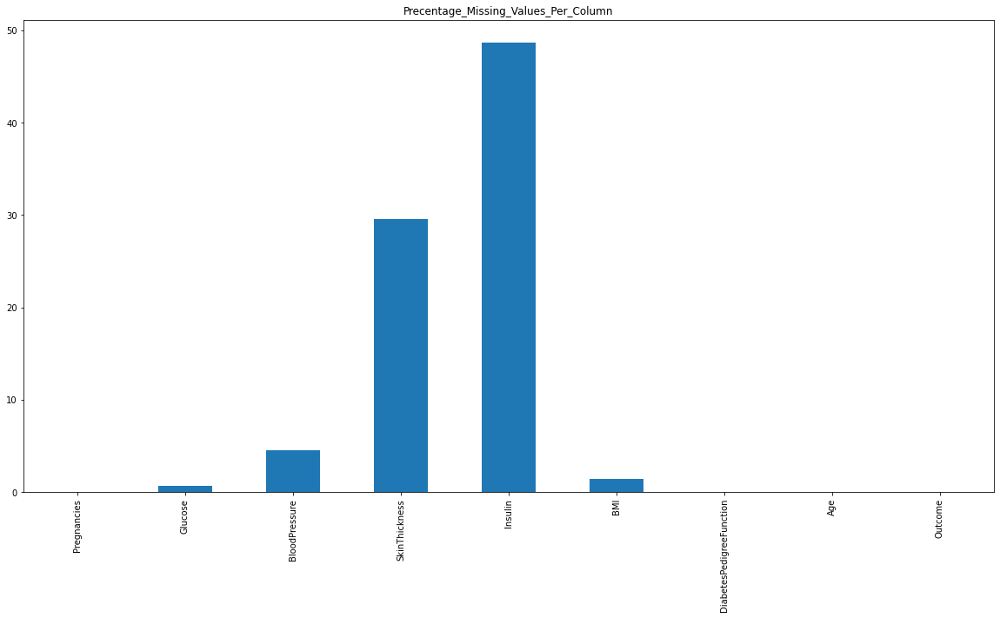
    


```python
msno.bar(df) # missing value of  whole datframe
```


    <AxesSubplot:>


    

    


```python

```

## Analysis:


```python

```


```python

```


```python

```

### 2.Calculate appropriate measures of central tendency for Glucose and outcome column only?

As we can see that with help of kde , histogram plot data is symmetrical.

We can use mean  as measures of central tendency for Glucose column.

Mean value of Glucose column is 121.69.


```python
x = df['Glucose']
plt.hist(x)
plt.title("Glucose_Column ditribution", fontsize= 15)
plt.show()
```


    
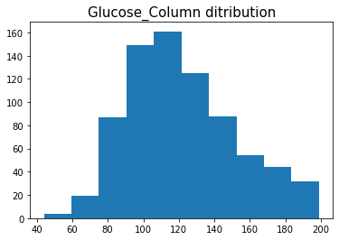
    


```python
sns.kdeplot(x,shade=True)
plt.title("Glucose_Column ditribution", fontsize= 15)
```


    Text(0.5, 1.0, 'Glucose_Column ditribution')


    
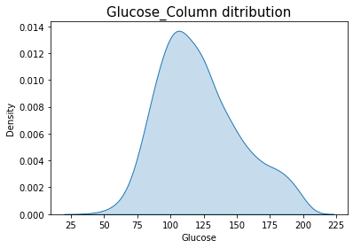
    


```python
print ("Mean Values in the Distribution of Glucose Column")
df['Glucose'].mean()
```

    Mean Values in the Distribution of Glucose Column
    


    121.6867627785059


The category column is bool type which is true or false.So ,we going to use mode measures of central tendency.

The mode for catogery column value of Zero/False.

Here means majority of people are non - daibetic. 


```python
print ("Mode of Outcome Column")
df['Outcome'].mode()
```

    Mode of Outcome Column
    


    0    False
    Name: Outcome, dtype: category
    Categories (2, object): [False, True]


### 3.Please provide 5 points data summaries for required columns?


```python
sns.set(rc={'figure.figsize':(11.7,8.27)})
sns.set_theme(style="whitegrid")
```


```python
sns.boxplot(data=df,palette="Set3",linewidth=2.5,orient="h",showfliers=False)
```


    <AxesSubplot:>


    
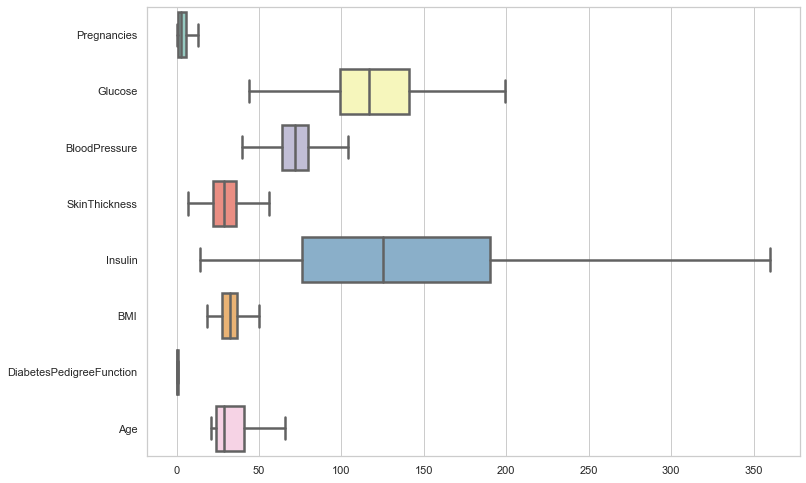
    


```python
df.agg('max')
```


    Pregnancies                    17
    Glucose                     199.0
    BloodPressure               122.0
    SkinThickness                99.0
    Insulin                     846.0
    BMI                          67.1
    DiabetesPedigreeFunction     2.42
    Age                          81.0
    Outcome                      True
    dtype: object


```python
df.columns
```


    Index(['Pregnancies', 'Glucose', 'BloodPressure', 'SkinThickness', 'Insulin',
           'BMI', 'DiabetesPedigreeFunction', 'Age', 'Outcome'],
          dtype='object')


```python
sns.set(rc={'figure.figsize':(4,2)})
```


```python
sns.boxplot(x='BloodPressure',data =df,linewidth=0.5,orient="h")
```


    <AxesSubplot:xlabel='BloodPressure'>


    
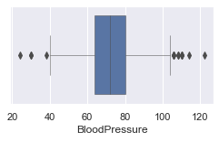
    


```python
sns.boxplot(x='Glucose',data =df,linewidth=0.5,orient="h")
```


    <AxesSubplot:xlabel='Glucose'>


    
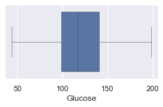
    


```python
sns.boxplot(x='SkinThickness',data =df,linewidth=0.5,orient="h")
```


    <AxesSubplot:xlabel='SkinThickness'>


    
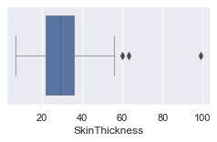
    


```python
sns.boxplot(x='Insulin',data =df,linewidth=0.5,orient="h")
```


    <AxesSubplot:xlabel='Insulin'>


    

    


```python
sns.boxplot(x='BMI',data =df,linewidth=0.5,orient="h")
```


    <AxesSubplot:xlabel='BMI'>


    
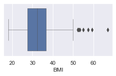
    


```python
sns.boxplot(x='DiabetesPedigreeFunction',data =df,linewidth=0.5,orient="h")
```


    <AxesSubplot:xlabel='DiabetesPedigreeFunction'>


    
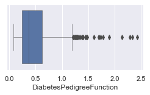
    


```python
sns.boxplot(x='Age',data =df,linewidth=0.5,orient="h",color=".50")
```


    <AxesSubplot:xlabel='Age'>


    
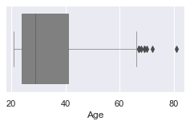
    


```python
sns.boxplot(x='Pregnancies',data =df,linewidth=0.5,orient="h",color=".25")
```


    <AxesSubplot:xlabel='Pregnancies'>


    
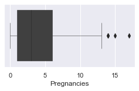
    


### 4.Please create an appropriate plot to examine the relationship between Age and Glucose.


```python
sns.lmplot(x="Age", y="Glucose",data=df,fit_reg=True)
```


    <seaborn.axisgrid.FacetGrid at 0x1ce3bf09700>


    
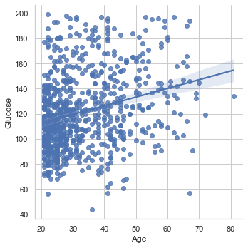
    


```python
sns.relplot(x="Age", y="Glucose", kind="line",height=7, data=df)
```


    <seaborn.axisgrid.FacetGrid at 0x1ce3a7dd400>


    
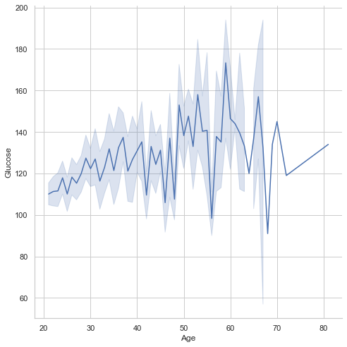
    


```python
sns.relplot(x="Age", y="Glucose",hue="Outcome", kind="line",height=10, data=df)
```


    <seaborn.axisgrid.FacetGrid at 0x1ce3c142070>


    
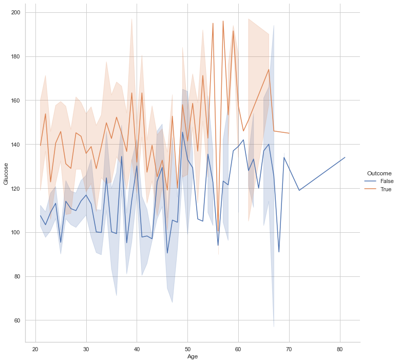
    


```python
sns.relplot(x="timepoint", y="signal", hue="event", kind="line", data=df);
```

### 5.Please create an appropriate plot to see the distribution of Outcome variable?


```python
plt.title(" Distribution of Outcome Variable", fontsize= 15)
df['Outcome'].value_counts().plot.bar(figsize=(5, 2))
```


    <AxesSubplot:title={'center':' Distribution of Outcome Variable'}>


    
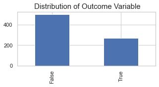
    


### 6.Please examine the distribution of numerical data and explain which variable normally distributed and which variable is seems to be skewed. Please also tell the direction of skewness.

Normally Distibuted:

    BloodPressure
    Gulucose

Right Skewed :

    Glucose
    BMI
    SkinThickness
    Pregnancies
    Age
    DiabetesPedigreeFunction
    Insulin


```python
df.columns
```


    Index(['Pregnancies', 'Glucose', 'BloodPressure', 'SkinThickness', 'Insulin',
           'BMI', 'DiabetesPedigreeFunction', 'Age', 'Outcome'],
          dtype='object')


```python
vals =['Pregnancies', 'Glucose', 'BloodPressure', 'SkinThickness', 'Insulin','BMI', 'DiabetesPedigreeFunction', 'Age']
```


```python
sns.catplot(x="X_Axis", y="vals", hue='cols', data=dfm, kind='point')
```


```python
print(df.hist(bins=100))
```

    [[<AxesSubplot:title={'center':'Pregnancies'}>
      <AxesSubplot:title={'center':'Glucose'}>
      <AxesSubplot:title={'center':'BloodPressure'}>]
     [<AxesSubplot:title={'center':'SkinThickness'}>
      <AxesSubplot:title={'center':'Insulin'}>
      <AxesSubplot:title={'center':'BMI'}>]
     [<AxesSubplot:title={'center':'DiabetesPedigreeFunction'}>
      <AxesSubplot:title={'center':'Age'}> <AxesSubplot:>]]
    


    
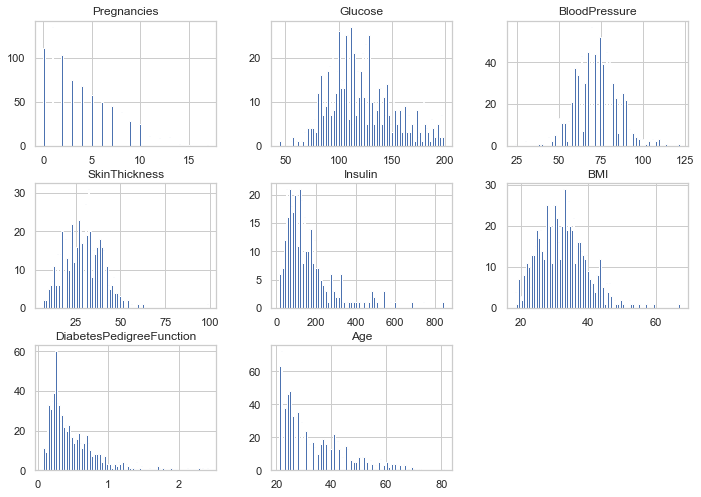
    


### 7.Please calculate the skewness value and divide variables into symmetrical, moderately skewed and highly skewed.


```python
skewValue = df.skew(axis=0,numeric_only=True,skipna=None)
```


```python
skewValue
```


    Pregnancies                 0.901674
    Glucose                     0.530989
    BloodPressure               0.134153
    SkinThickness               0.690619
    Insulin                     2.166464
    BMI                         0.593970
    DiabetesPedigreeFunction    1.919911
    Age                         1.129597
    dtype: float64


```python
if i in skewValue:
    skew<0.5
    print ("then very symmetric")
```

Symmetric :

    BloodPressure

Moderatety Skewed :

    Glucose
    BMI
    SkinThickness
    Pregnancies
Highly Skewed :

    Age
    DiabetesPedigreeFunction
    Insulin

Observation:


· If the absolute value of skew<0.5 then very symmetric.

· If the absolute value of skew is in between 0.5 and 1 then slightly skewed

· If the absolute value of skew is greater than 1 then very skewed.


### 8.Please create appropriate plot to examine the outliers of these variables. Please name the variables which have outliers.

Nmae of Varriable which contain outliers :

    * Pregnancies
    
    * BloodPressure
    
    * SkinThickness
    
    * Insulin
    
    * BMI
    
    * DiabetesPedigreeFunction
    
    * Age


```python
fig, ax = plt.subplots(figsize=(24,24), nrows=3, ncols=3)
sns.boxplot(data=df, y="Pregnancies", ax=ax[0,0])
sns.boxplot(data=df, y="Glucose", ax=ax[0,1])
sns.boxplot(data=df, y="BloodPressure", ax=ax[0,2])
sns.boxplot(data=df, y="SkinThickness", ax=ax[1,0])
sns.boxplot(data=df, y="Insulin", ax=ax[1,1])
sns.boxplot(data=df, y="Age", ax=ax[2,1])
sns.boxplot(data=df, y="BMI", ax=ax[2,0])
sns.boxplot(data=df, y="DiabetesPedigreeFunction", ax=ax[1,2])
```


    <AxesSubplot:ylabel='DiabetesPedigreeFunction'>


    
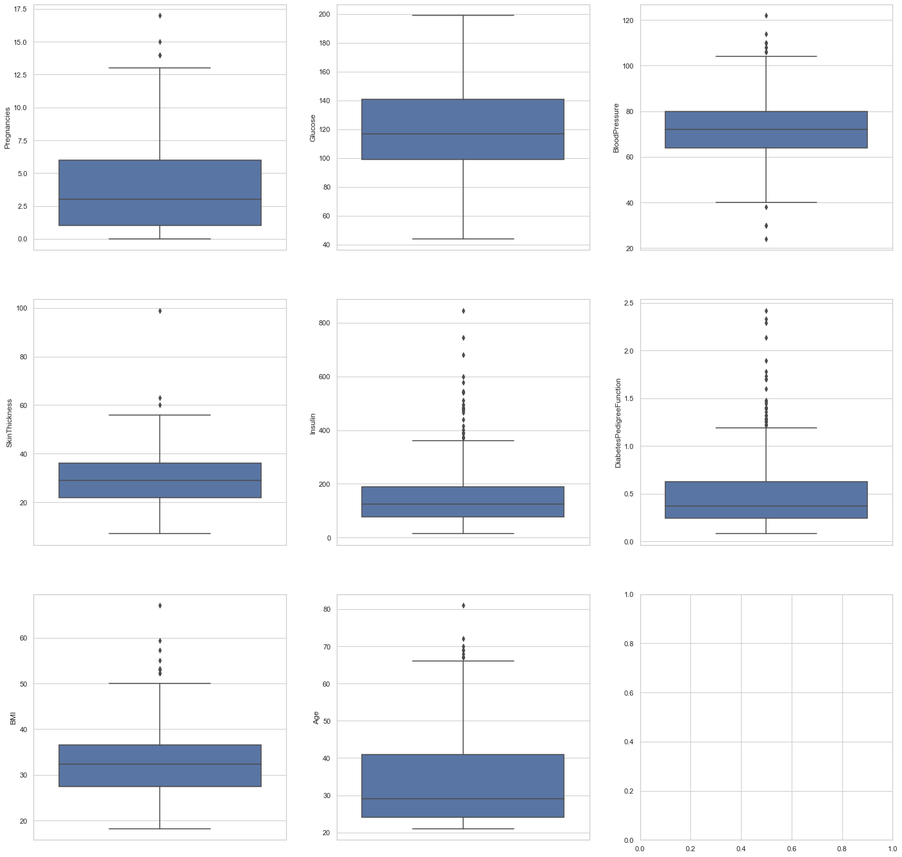
    


### 9.What should be the measures of central tendency and dispersion for skewed data? 


```python
df5 =df.aggregate({'Pregnancies':['max', 'min','var','std',np.median],'Insulin':['max', 'min','var',np.median,'std'],'SkinThickness':['max', 'min','var',np.median,'std'],'DiabetesPedigreeFunction':['max', 'min','var','std',np.median],'BMI':['max', 'min','var',np.median,'std'],'Age':['max', 'min','var',np.median,'std']})
```


```python
df5
```


<div>
<style scoped>
    .dataframe tbody tr th:only-of-type {
        vertical-align: middle;
    }

    .dataframe tbody tr th {
        vertical-align: top;
    }

    .dataframe thead th {
        text-align: right;
    }
</style>
<table border="1" class="dataframe">
  <thead>
    <tr style="text-align: right;">
      <th></th>
      <th>Pregnancies</th>
      <th>Insulin</th>
      <th>SkinThickness</th>
      <th>DiabetesPedigreeFunction</th>
      <th>BMI</th>
      <th>Age</th>
    </tr>
  </thead>
  <tbody>
    <tr>
      <th>max</th>
      <td>17.000000</td>
      <td>846.000000</td>
      <td>99.000000</td>
      <td>2.420000</td>
      <td>67.100000</td>
      <td>81.000000</td>
    </tr>
    <tr>
      <th>min</th>
      <td>0.000000</td>
      <td>14.000000</td>
      <td>7.000000</td>
      <td>0.078000</td>
      <td>18.200000</td>
      <td>21.000000</td>
    </tr>
    <tr>
      <th>var</th>
      <td>11.354056</td>
      <td>14107.703775</td>
      <td>109.767160</td>
      <td>0.109779</td>
      <td>47.955463</td>
      <td>138.303046</td>
    </tr>
    <tr>
      <th>std</th>
      <td>3.369578</td>
      <td>118.775855</td>
      <td>10.476982</td>
      <td>0.331329</td>
      <td>6.924988</td>
      <td>11.760232</td>
    </tr>
    <tr>
      <th>median</th>
      <td>3.000000</td>
      <td>125.000000</td>
      <td>29.000000</td>
      <td>0.372500</td>
      <td>32.300000</td>
      <td>29.000000</td>
    </tr>
  </tbody>
</table>
</div>


```python
def find_iqr(x):
  return np.subtract(*np.percentile(x, [75, 25]))
df[['Pregnancies','SkinThickness', 'Insulin','BMI', 'DiabetesPedigreeFunction', 'Age']].apply(find_iqr)

```


    Pregnancies                  5.0000
    SkinThickness                   NaN
    Insulin                         NaN
    BMI                             NaN
    DiabetesPedigreeFunction     0.3825
    Age                         17.0000
    dtype: float64


```python
from scipy.stats import iqr
```


```python
iqr(df['Insulin'])
```


    nan


```python

```
